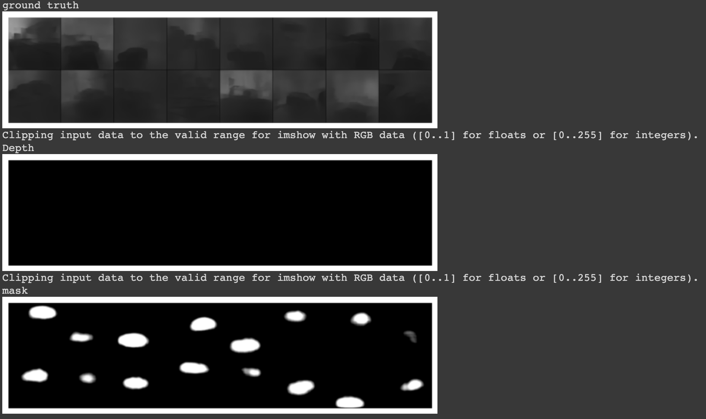
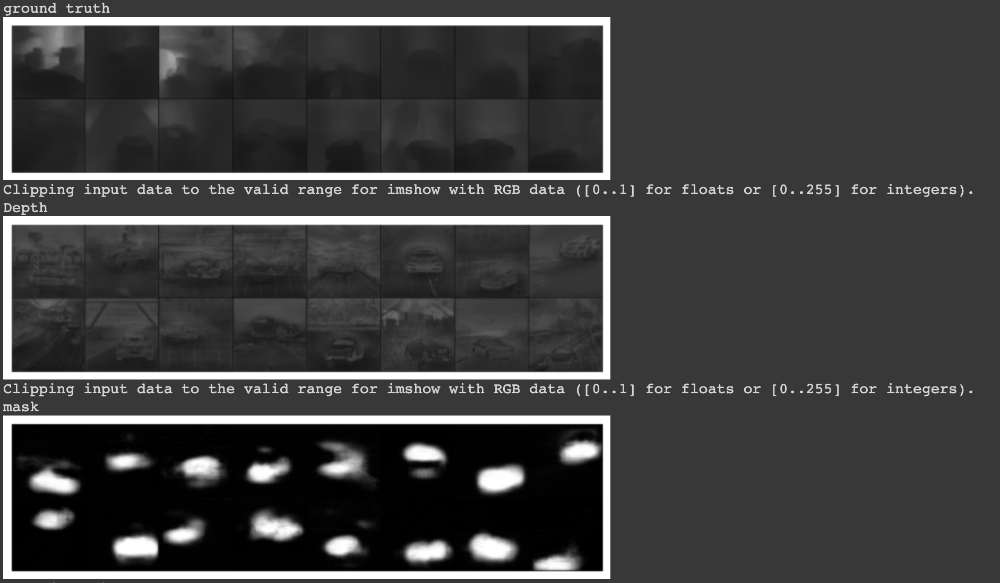
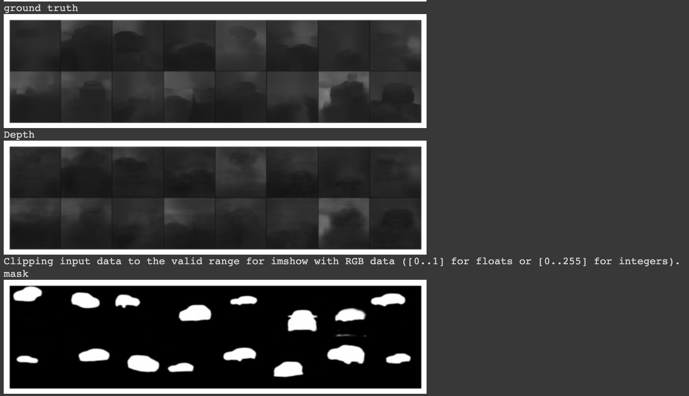

# S15 - Depth Estimation and Segmentation

### Objective
Given an image with foreground objects and background image, predict the depth map as well as a mask for the foreground object.

### Dataset
A custom dataset will be used to train this model, which consists of:
- 100 background images
- 400k foreground overlayed on background images
- 400k masks for the foreground overlayed on background images
- 400k depth maps for the foreground overlayed on background images

Dataset Link: https://drive.google.com/file/d/16La8BoYHEp8b0swlB-2Eyny00Yjeg80d/view?usp=sharing

Dataset Creation: [S15A_01_DataCreation.ipynbhttps://github.com/seepala98/EVA-4/blob/master/PHASE_1/S14/](https://github.com/seepala98/EVA-4/blob/master/PHASE_1/S14/)

#### Notations
- Background image: **bg**
- Foregroung overlayed on background: **fg_bg**
- Mask for fg_bg: **fg_bg_mask**
- Depth map for fg_bg: **fg_bg_depth**
- Mask prediction: **s_out**
- Depth map prediction: **d_out**

### Model

The inputs to the model are **bg** and **fg_bg**.
- bg   : `[3 x 256 x 256]`
- fg_bg: `[3 x 256 x 256]`

The outputs of the model are **mask_pred** and **depth_pred**.
- mask_pred: `[1 x 256 x 256]`
- depth_pred: `[1 x 256 x 256]`

Model definition file: [https://github.com/seepala98/EVA-4/blob/master/PHASE_1/S15/src/models/ResUNet.py](https://github.com/seepala98/EVA-4/blob/master/PHASE_1/S15/src/models/ResUNet.py)

#### Parameters Count
```
============================================
Total params: 17,267,393
Trainable params: 17,267,393
Non-trainable params: 0
--------------------------------------------
Input size (MB): 0.05
Forward/backward pass size (MB): 58.88
Params size (MB): 65.87
Estimated Total Size (MB): 124.79
--------------------------------------------
```

### Parameters and Hyperparameters

-   Optimizer: SGD
-   Scheduler: ReduceLROnPlateau
-   Batch Size: 16 for `224x224`
-   L2 decay: 0.001


### Image Augmentation
- **Resize**:
	- Downscale the images to be able to train for lower dimensions first.
	- Applied on **bg**, **fg_bg**, **fg_bg_mask** and **fg_bg_depth**.
- **RGBShift** & **HueSaturationValue**:
	- Used to reduce the dependency on image colours for prediction.
	- One of these was applied randomly to **bg** and **fg_bg** images.
- **GaussNoise**:
	- Gaussian noise was applied randomly to **bg** and **fg_bg** images.
- **RandomRotate**:
	- Images were randomly rotated within (-10,10) degrees.
	- Applied on **bg**, **fg_bg**, **fg_bg_mask** and **fg_bg_depth**.
	- Here, all the 4 images were rotated in the same direction and angle to maintain the orientation.

### Loss Function

The loss function used is a weighted average of:
- **L1 loss**: Handles the per pixel differences.
- **Dice Loss**: Handles luminance, contrast and structural differences.

The overall loss was a summation of loss for mask and depth.

    loss1 = criterion(s_out, data['fg_bg_mask'])
    loss2 = criterion(d_out, data['depth_fg_bg']) 

    loss = 2 * loss1 +  loss2

**BCE loss** could construct the structure of the prediction but not proper constrast for the mask and sharpness for mask and depth images tried various loss functions which includes BCEWithLogitsLoss(), SSIM() but only Dice Loss was able to get the desired result 

Loss function file: [https://github.com/seepala98/EVA-4/blob/master/PHASE_1/S15/src/Utils/DiceLoss.py](https://github.com/seepala98/EVA-4/blob/master/PHASE_1/S15/src/Utils/DiceLoss.py)

### Training and Validation

Begin with a smaller resolution of 64x64 images and then resized it to 256. Going anything about this is drastically increasing the training per epoch time for the above mentioned resolution it was able to finish off one epoch in around ~3hr on a P100 in google Colab

Training : [https://github.com/seepala98/EVA-4/blob/master/PHASE_1/S15/src/dataset/DenseDepth.py](https://github.com/seepala98/EVA-4/blob/master/PHASE_1/S15/src/dataset/DenseDepth.py)

### Results
Dimensions:

    bg         : [3, 256, 256]
    fg_bg      : [3, 256, 256]
    fg_bg_mask : [1, 256, 256]
    fg_bg_depth: [1, 256, 256]
    mask_pred  : [1, 256, 256]
    depth_pred : [1, 256, 256]
    
### Visualization : 

***without using the DICE LOSS which produced no Depth but has mask :***



***using Dice Loss function which gave depth and mask over training on 200 images :***



***using Dice Loss function which gave the depth and mask after training 25k images :***


