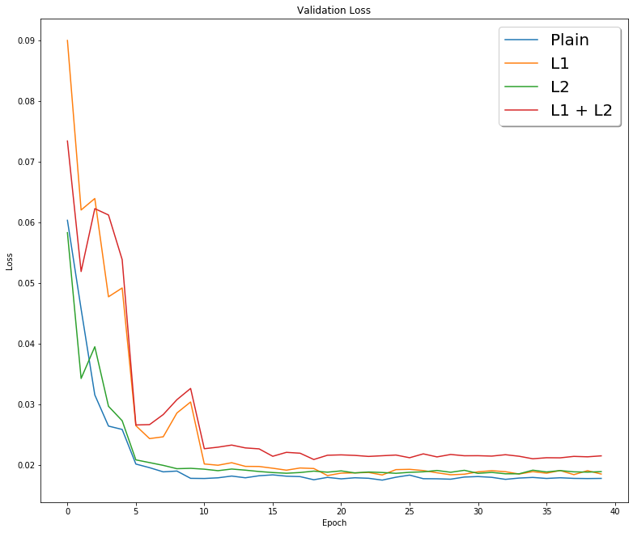
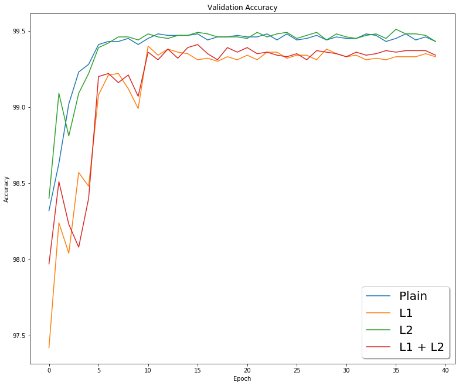
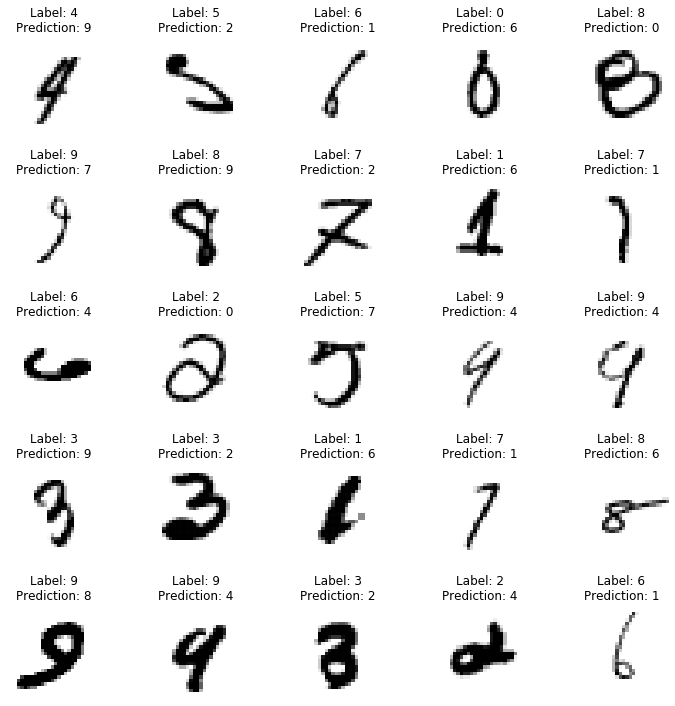
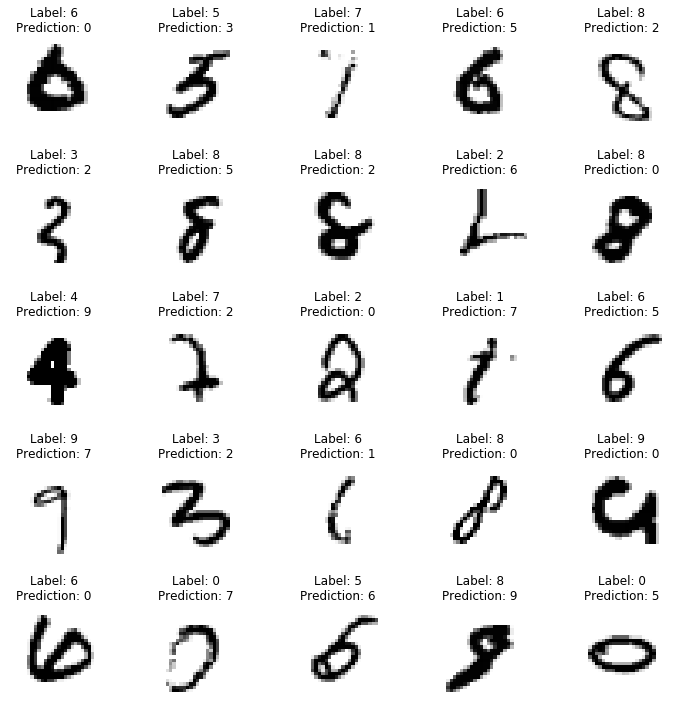
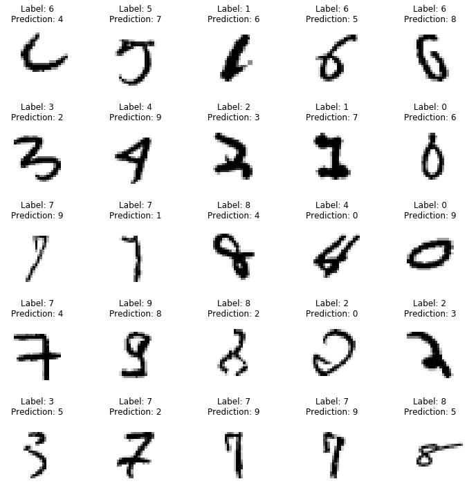
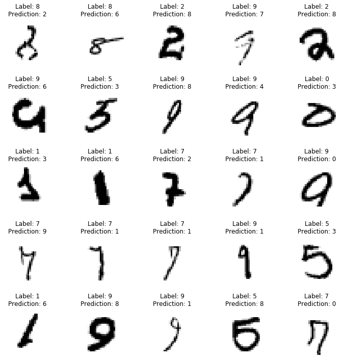

# S6 - Regularization 

The goal of this assignment is to apply L1 and L2 regularization on the final model from the [previous](../S4/) session and plot the changes in validation loss and accuracy obtained during model training in the following scenarios:

1. Without L1 and L2 regularization
2. With L1 regularization
3. With L2 regularization
4. With L1 and L2 regularization

After model training, display 25 misclassified images for L1 and L2 models.

### Parameters and Hyperparameters

- Kernel Size: 3x3
- Loss Function: Negative Log Likelihood
- Optimizer: SGD
- Dropout Rate: 0.05
- Batch Size: 64
- Learning Rate: 0.01
- **L1 Factor:** 0.005
- **L2 Factor:** 0.005

## Results

### Change in Validation Loss and Accuracy

## Misclassified Images

### Without L1 and L2 Regularization

### With L1 Regularization

### With L2 Regularization

### With L1 AND L2 Regularization

